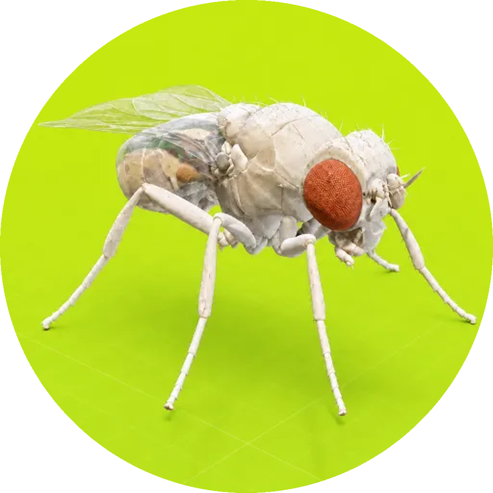

<p align="center">
  
</p>

<h1 align="center">The Fly Brain</h1>

<p align="center"><a href="https://github.com/theflyRH/thefly-brain/actions/workflows/reproduce.yml"></a></p>

<p align="center">
  A whole-brain <em>Drosophila</em> connectome simulation that decides on-chain token buybacks by proboscis extension.<br>
  <a href="https://inthebrainofafly.com"><b>inthebrainofafly.com</b></a> · <a href="https://inthebrainofafly.com/study">Technical report</a>
</p>

https://github.com/user-attachments/assets/9a27f897-9da2-4d25-bb91-067c19c7a094

---

## What this repository is

This is the neuroscience core of [The Fly](https://inthebrainofafly.com) ($FLY on Robinhood Chain, launched on PONS): the code that simulates the complete
FlyWire female *Drosophila melanogaster* brain connectome (v783, **138 639 neurons, 15 091 983 synaptic
rows**) as a leaky integrate-and-fire network, stimulates the fly's sugar-sensing gustatory receptor
neurons, and reads out the proboscis-extension motor neuron **MN9**. In production, MN9 firing is the
event that triggers a buyback of $FLY on Robinhood Chain with the creator fees it has earned, followed by a burn.

It is published as the *proof* behind the project: every number on the site can be reproduced from
this repository with the public connectome data. Nothing here is a mock; the mock mode in
`flybrain/server.py` exists only for front-end development and is labelled as such on the wire.

What is **not** here: the web front end, the Robinhood Chain transaction code (PONS fee claim, buyback and burn), and the embodied body simulation
(the latter is the open-source [desktop-fly](https://github.com/DenisSergeevitch/desktop-fly) pipeline,
vendored unchanged apart from a proboscis handle).

## The claim, and how it is tested

> When the fly's labellar sugar GRNs are driven, the measured wiring of the fly brain makes MN9 fire.
> At rest, it does not. The buyback therefore depends on the real connectome, not on a scripted rule.

| Condition | Simulated time | MN9 spikes | Neurons that spiked |
|---|---|---|---|
| Sugar GRNs, Poisson 150 Hz (bench) | 300 ms | 20 | 354 |
| Rest, no input (bench) | 300 ms | 0 | 0 |
| Sugar GRNs, live trial 1 | 1 000 ms | 85 | 375 |
| Sugar GRNs, live trial 2 | 1 000 ms | 81 | 365 |
| Sugar GRNs, live trial 3 | 1 000 ms | 82 | 369 |
| Sugar GRNs, live trial, early stop | 100 ms | 8 | 291 |
| **Control: same sugar drive, connectome randomly rewired** | 300 ms | **0** | 109 |

Measured on this code, FlyWire v783, Brian2 2.10, numpy backend (`bench.py`) and the production
websocket server. **The same benchmark runs on GitHub's machines on every push and weekly**
([Actions → Reproduce MN9 result](https://github.com/theflyRH/thefly-brain/actions/workflows/reproduce.yml)):
the log of each run is public and anyone can trigger a new one.

**Control.** `python bench.py --shuffle` keeps every neuron, every synaptic weight and every parameter
but randomly permutes the postsynaptic targets. With the wiring destroyed, sugar drive no longer reaches
MN9. This is the control used by Shiu et al. (shuffled connectivity drops their behavioural prediction
accuracy from 91–95 % to ~1 %); it separates "the code makes MN9 fire" from "the connectome makes MN9 fire". The zero-spike control matters: the eat decision cannot be produced by background
noise, it requires the sugar input propagating through the measured synapses.

## Model

The network follows Shiu et al. (2024), *Nature* 634:210–219, whose code and data are used directly.

```
dv/dt = (v0 − v + g) / τm        (unless refractory)
dg/dt = −g / τs                  (unless refractory)
spike when v > vth ; then v ← vrst, g ← 0
on presynaptic spike, after delay td:  g ← g + w
```

| Parameter | Value | Source |
|---|---|---|
| v0 = vrst | −52 mV | Kakaria & de Bivort 2017 |
| vth | −45 mV | idem |
| τm | 20 ms | idem |
| τs | 5 ms | Jürgensen et al. 2021 |
| refractory | 2.2 ms | Lazar et al. 2021 |
| td | 1.8 ms | Paul et al. 2015 |
| wsyn | 0.275 mV × signed synapse count | free parameter, Shiu et al. |
| integration | 0.1 ms, exact linear (Brian2) | |

Stimulated neurons receive an independent Poisson input (150 Hz, weight wsyn × 250) and a zero
refractory period, as in the reference implementation. The network is built once and restored to
rest before each trial (`Network.store/restore`), so trials are independent.

### Neurons

`flybrain/neurons.py` lists the FlyWire root ids. They come from Shiu et al.'s `figures.ipynb`
(assigned on v630); the ones used were verified to persist in v783 with the expected annotation:

| Population | Ids present in v783 | FlyWire annotation |
|---|---|---|
| Labellar sugar GRNs (right) | 20 of 21 | sensory / gustatory / sugar-water, type LB3 |
| Labellar bitter GRNs (right) | 20 of 21 | sensory / gustatory / bitter, types LB1a–c |
| MN9 (left), `720575940660219265` | 1 | motor / brain_motor_neuron / ingestion_motor_neuron, CB0701 |

### Trial protocol used in production

1. Contact between the fly's tarsi and a drop triggers `stimulate(sugar, 400 ms)`.
2. The server streams a 10 ms activity frame for every chunk (indices of neurons that spiked, MN9 flag).
3. The trial stops early once MN9 has fired 4 times (after ≥ 100 ms), otherwise runs to the end.
4. Decision: **eat** if MN9 spiked at least once. Eat → buyback.

## Reproduce

```bash
python -m venv .venv && .venv/bin/pip install -r requirements.txt
bash data/download.sh          # FlyWire v783 completeness + connectivity (Shiu et al. repo, ~104 MB)
python bench.py --duration 300 --stimuli sugar,idle,bitter
python bench.py --duration 300 --stimuli sugar --shuffle     # control: rewired connectome
```

Expected output (numpy backend, one CPU core, ~40 s per 300 ms of brain time):

```
sugar: sim 300 ms in 40.4 s wall | MN9 spikes=20 eat=True active=354
idle:  sim 300 ms in 32.2 s wall | MN9 spikes=0  eat=False active=0
```

With a C++ toolchain Brian2 uses its Cython backend (`--codegen cython`), which is what the Docker
image does; the network then builds in about 12 s.

Run the production server:

```bash
python -m flybrain.server --host 0.0.0.0 --port 8765
# or
docker build -t thefly-brain . && docker run -p 8765:8765 thefly-brain
```

Websocket protocol (JSON), one trial at a time:

```
→ {"type":"hello","neurons":138639,"synapses":15091983,"dataset":"flywire_v783","mock":false}
← {"type":"stimulate","trialId":"t1","stimulus":"sugar","durationMs":400}
→ {"type":"frame","trialId":"t1","frame":{"tMs":10,"spiking":[...],"mn9":false}}   (every 10 ms)
→ {"type":"result","trialId":"t1","mn9Spikes":8,"eat":true,"activeNeurons":291,"simMs":100,"wallMs":23300}
```

Every production tasting is also logged publicly at
[/api/trials](https://inthebrainofafly.com/api/trials): MN9 spike count, neurons recruited,
simulated and wall time, and the buy and burn transaction hashes it produced, so each buyback can be
traced back to a trial.

`flybrain/export_atlas.py` writes the soma positions of all 138 639 neurons (`data/atlas_v783.json`,
included) that the site uses to draw the brain; `spiking` indices in frames refer to this ordering.

## Limitations, stated plainly

- No neuromodulation, plasticity or internal state: a hungry and a sated fly are identical.
- The whole-brain model decides; locomotion runs on a separate connectome-derived body network.
  They share their data source, not their activity.
- MN9 right is absent from the v783 completeness table; only the left MN9 is read.
- The trial is stopped early once the decision is made. The full 1 s protocol of Shiu et al. gives
  the same answer with more spikes (table above).
- This is a simulation constrained by a wiring diagram, not an "uploaded" fly.

## Data and licenses

- Code: MIT (this repository). Buyback and burn run on Robinhood Chain (chain id 4663) against the PONS V2 launchpad contracts; that adapter lives in the site repository, not here. Model equations and parameters from
  [philshiu/Drosophila_brain_model](https://github.com/philshiu/Drosophila_brain_model) (MIT).
- Connectome tables `Completeness_783.csv` and `Connectivity_783.parquet` are downloaded from that
  repository; they derive from FlyWire (**CC BY-NC 4.0**). Soma positions from
  [FlyWire Codex](https://codex.flywire.ai) v783. Not redistributed here except the derived atlas.
- Brian2 (Stimberg, Brette & Goodman 2019).

## References

1. Shiu PK et al. A Drosophila computational brain model reveals sensorimotor processing. *Nature* 634, 210–219 (2024).
2. Dorkenwald S et al. Neuronal wiring diagram of an adult brain. *Nature* 634, 124–138 (2024).
3. Schlegel P et al. Whole-brain annotation and multi-connectome cell typing of Drosophila. *Nature* 634, 139–152 (2024).
4. Kakaria KS, de Bivort BL. Ring attractor dynamics emerge from a spiking model of the entire protocerebral bridge. *Front. Behav. Neurosci.* 11, 8 (2017).
5. Stimberg M, Brette R, Goodman DFM. Brian 2, an intuitive and efficient neural simulator. *eLife* 8, e47314 (2019).
6. Shiryaev D. desktop-fly. github.com/DenisSergeevitch/desktop-fly (2026), MIT.
